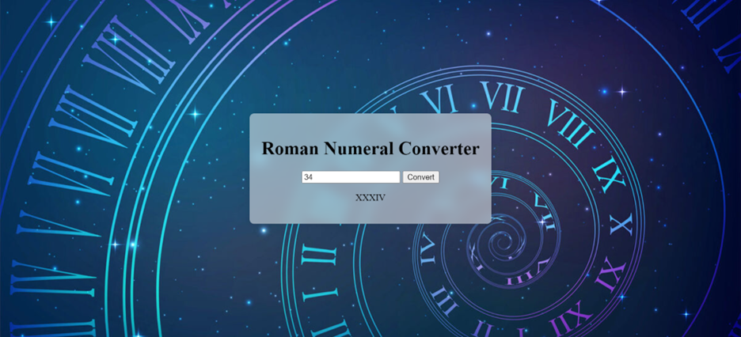

# Roman Numeral Converter 🚀

## A web app that converts numbers to Roman numerals and checks if they are even or odd, featuring a frosted glass effect for a visually appealing interface.📝

> A versatile web app that converts numbers to Roman numerals and verifies if they are even or odd, offering both educational and practical benefits. The app features a frosted glass design for an elegant, modern look, ensuring a user-friendly and visually appealing experience

```css
.container, .checker-container {
    text-align: center;
    background: rgba(255, 255, 255, 0.5); /* Semi-transparent background */
    padding: 20px;
    border-radius: 8px;
}
```
```javascript
for (let [roman, value] of romanNumerals) {
        while (num >= value) {
            result += roman;
            num -= value;
        }
    }
```

## Demo 📸
[live Demo] (https://elhamy786.github.io/Roman-Numeral/)


## Technologies Used 🛠️
- HTML
- CSS
- JavaScript

## Installation 💻

Provide step-by-step instructions on how to install and set up your project. Include any dependencies or prerequisites that need to be installed.

```bash
1: Clone the Repository:
git clone https://github.com/elhamy786/Roman-Numeral.git
```

```bash
2: Navigate to the Project Directory:
cd Roman-Numeral
```

```bash
3: Open the index.html File in Your Browser.
```

## Usage 🎯

```bash
To use the Roman Numeral Converter and Number Checker web app, simply clone the repository, open index.html in your browser, enter a number in the input field, and click "Convert" to see the Roman numeral and whether the number is even or odd, with a visually appealing frosted glass effect applied through styles.css and functionality provided by script.js.
```

## Features ⭐

- Roman Numeral Conversion: Converts numbers between 1 and 3999 into their Roman numeral equivalents.
- Number Checker: Determines whether the entered number is even or odd.
- User-Friendly Interface: Simple and intuitive design with clear instructions and outputs.

## Author 👩‍💻
- [Linkedin](https://www.linkedin.com/in/elham-afzali-05326130b?utm_source=share&utm_campaign=share_via&utm_content=profile&utm_medium=ios_app)
- [Email](elham.afzali1383@gmail.com)

## Contributing 🤝
To contribute to the Roman Numeral Converter and Number Checker project, fork the repository, create a branch for your feature or bug fix, make and commit your changes, push the branch to your fork, and open a pull request on the original repository with a detailed description; for bug reports or feature requests, open an issue with clear details, and follow the existing code style and documentation standards.